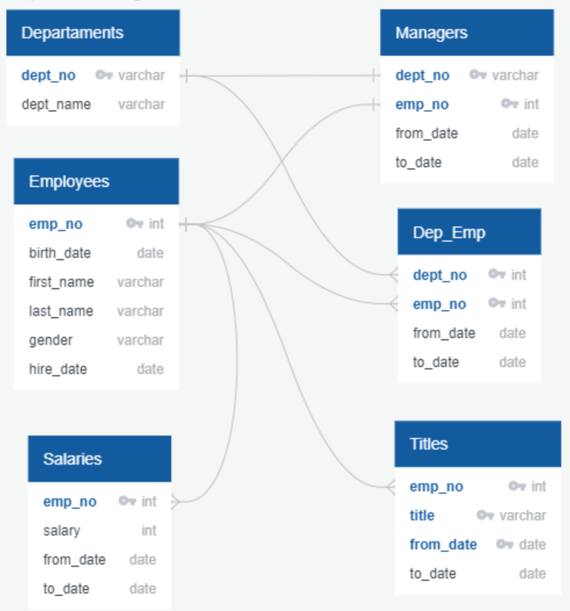
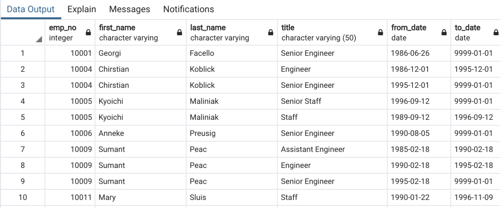
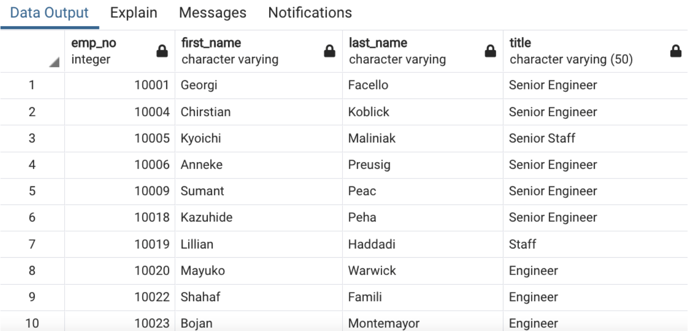
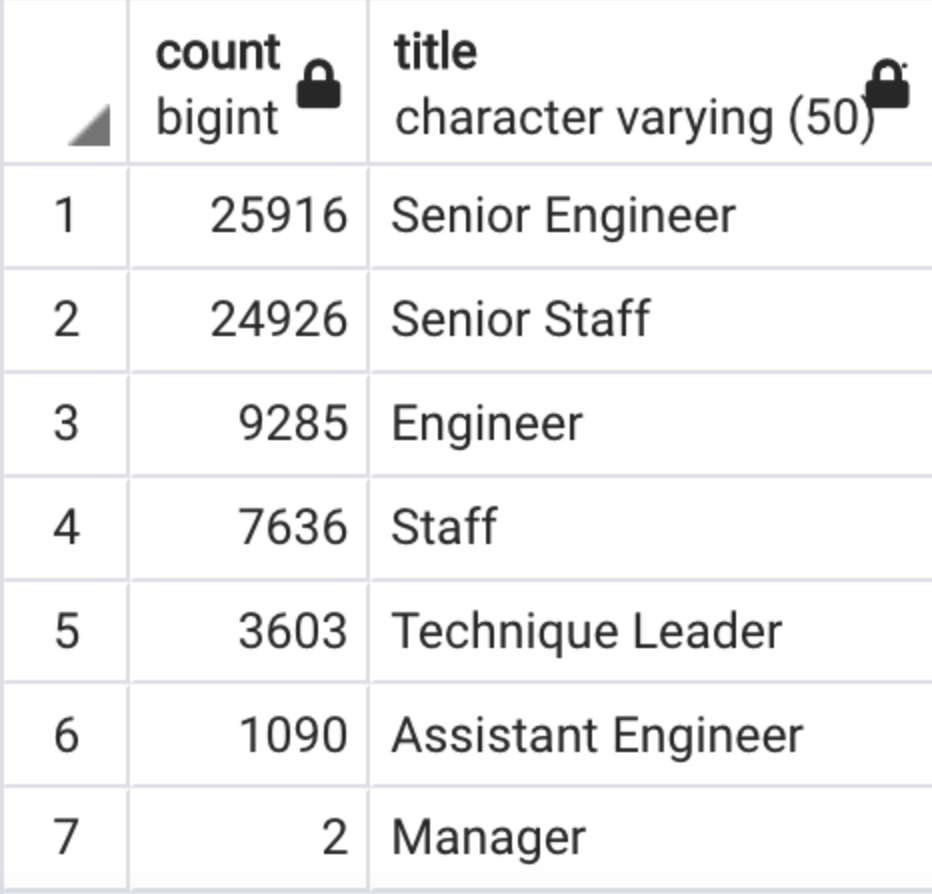
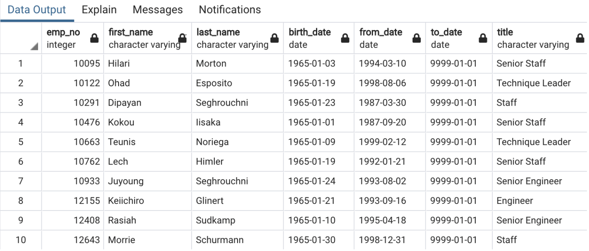
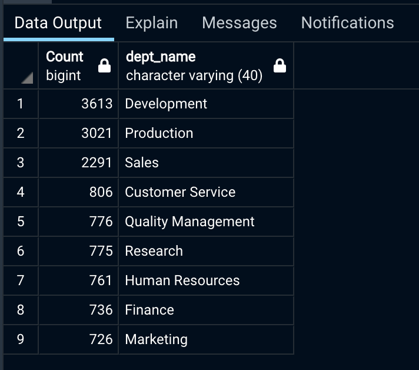

# Pewlett-Hackard Analysis

## Project Overview 
### Purpose
The purpose of this analysis is to prepare Pewlett-Hackard, a company with several thousand employees, for the upcoming “silver tsunami”, where a large number of employees will retire at a rapid rate within the next few years. As a result, the company needs to be prepared with retirement packages, open positions as well as employees’ training's in order to ensure a smooth transition 

The following analysis emphasizes a focus on the following points: 

1.	Identify the retiring employees by their title.
2.	Determine the sum of retiring employees grouped by title.
3.	Identify the employees eligible for participation in the mentorship program.
4.	Determine the number of roles-to-fill grouped by title and department.
5.	Determine the number of qualified, retirement-ready employees to mentor the next generation grouped by title and department.

### Background
The data is gathered in six CSV files and the analysis performed using relational databases. In this analysis the following tools were employed:
- **QuickDBD** to create quick database design for better visualization,
- **PostreSQL** a database system to load, build and host company’s data, and 
- **pgAdmin** a GUI, using SQL Language to explore, manipulate and extract the data. 

Where constraints were utilized to model and engineer the data such so that the outputted data was limited to show data entries that directly answer the questions at hand, providing accuracy and reliability when doing so to further prevent any abnormalities or errors.

## ERD and Schema

**ERD**
In order to design a database, it has to have a structure/model, such so we employ an entity-relationship diagram (ERD) to do so as can be seen by the image below.

<p align="center">  

</p>
<p align="center">  
<i>Figure 1: ERD</i>
</p>

**Schema**
A [schema](schema.sql) refers to the architecture of how data will look. It is a description of the actual construction of the database that refers to the collective of tables, columns, triggers, relationships, key constraints, functions and procedures. Schemas are important for designing database management systems (DBMS) or relational database management systems (RDBMS). 

## Results  

**1.	The list of retiring employees**
-	The table includes employee number, first name, last name, title, from-date and to-date.
-	The query returns 133,776 rows. 
-	The table displays a list of employees who is going to retire in the next few years.
-	The list is long and extensive, yet at-a-glance analysis gives us some insights about the query. Some employees appear more than once due to change of title during their career at Pewlett-Hackard.
<p align="center">  

</p>
<p align="center">  
<i>Figure 2: Table with the employee’s data that are retirement-ready</i>
</p>

  **Overview of the code**
  
To retrieve the data, two tables were merged together - employees and titles - with the `inner join` and filtered by birth date, that indicates who is about to retire in the next few years with the command `WHERE (e.birth_date BETWEEN '1952-01-01' AND '1955-12-31')`. 

:exclamation: The query has one drawback. It contains all the titles that employees acquired while working at Pewlett-Hackard over the years. This resulted in duplicates, some employees appear two times or more; therefore, the number of retiring employees (133,776) is huge and incorrect.

**2.	The list of retiring employees without duplicates**
-	The table includes employee number, first name, last name, title, from-date and to-date.
-	The query returns 90,398 rows. 
- The table displays a list of employees who are going to retire in the next few years.
-	In the table each employee is listed only once, by her or his most recent title.
<p align="center">  

</p>
<p align="center">  
<i>Figure 3: Table with the employee’s data that are retirement-ready without duplicates</i>
</p>

**Overview of the code**

Query contains the same data as the query above with addition of `distinct_on` command that kept only unique values. To ensure that most recent values are kept, I used command `ORDER BY rt.emp_no, rt.to_date DESC` to sort the data by descending order on the `to_date` column. In this case the most recent title was listed first, and after running the query the duplicates listed after the first appearance of the same employees were removed.

**3.	The number of retiring employees grouped by title**
-	The table includes employees’ titles and their sum. 
-	The query returns a cohesive table with 7 rows.
-	From this table we can quickly see how many employees with certain title will retire in the next few years.

<p align="center">  

</p>
<p align="center">  
<i>Figure 4: Table with the employee grouped by title</i>
</p>

**Overview of the code**

In order to retrieve this table I used `GROUP BY ut.title` command, and it is responsible for grouping the rows by titles. Next, I used its corresponding command `COUNT (ut.title)` that counts how many times specific title appears in the database. 

**4.	The employees eligible for the mentorship program**
-	The table contains employee number, first name, last name, birth date, from date, to date and title. 
-	The query returns 1,549 rows.
- The table displays a list of employees who is eligible for the mentorship program.
<p align="center">  

</p>
<p align="center">  
<i>Figure 5: Table with the employee grouped by title</i>
</p>

**Overview of the code**

To retrieve this data, three tables were merge together: employees, titles and dep_emp with the `inner join`. The query filters by birth date (that indicates who is eligible for the mentorship program) with the command ` WHERE (e.birth_date BETWEEN '1952-01-01' AND '1955-12-31') ` and `to_date`  to include only current employees. Duplicates were removed by `DISTINCT ON (e.emp_no)` command. To ensure I got the most recent titles, I used `ORDER BY e.emp_no, ti.from_date DESC` command.

Full reports in CSV files [here](exports/) and SQL Queries [here](Employee_Database_Challenge.sql) 


## Summary
***How many roles will need to be filled as the "silver tsunami" begins to make an impact?***<br>

As the company prepares for the silver tsunami, the plan would be to prepare new hires for 13,505 employees i.e. 

1.the number of people that are currently working at the company

2. have been there since 1985 to 1988
      
3. their birth date is between 1962 and 1965 to be eligible to leave work
  

and to offer these people a path into mentorship program so that they may keep mentoring new employees. However, shpuld they decide to part ways, Pewlett-Hackard should be ready to hire the afformentioned number of employees.

```
SELECT DISTINCT ON (emp_no) e.emp_no, 
                            e.first_name, 
                            e.last_name, 
                            e.birth_date,
                            de.from_date,
                            de.to_date, 
                            t.title
INTO employees_leaving
FROM employees as e
JOIN dept_emp as de
ON (e.emp_no = de.emp_no)
JOIN titles as t
ON (e.emp_no = t.emp_no)
WHERE (de.to_date = '9999-01-01') AND (e.birth_date BETWEEN '1962-01-01' AND '1965-12-31')
	AND (de.from_date BETWEEN '1985-01-01' AND '1988-12-31')
ORDER BY e.emp_no
```

To download: [employees_leaving.csv](exports/employees_leaving.csv)

***Are there enough qualified, retirement-ready employees in the departments to mentor the next generation of Pewlett-Hackard employees?***<br>

Now, to check if there are enough potential mentors in all of the departments, we recreated the employees_leaving table to add the department they belong to. 

```
SELECT DISTINCT ON (emp_no) e.emp_no, 
                            d.dept_name, 
                            e.first_name, 
                            e.last_name, 
                            e.birth_date, 
                            de.from_date, 
                            de.to_date, 
                            t.title
INTO employees_leaving_by_dept
FROM employees as e
JOIN dept_emp as de
ON (e.emp_no = de.emp_no)
JOIN titles as t
ON (e.emp_no = t.emp_no)
LEFT JOIN departments as d
ON (de.dept_no = d.dept_no)
WHERE (de.to_date = '9999-01-01') AND (e.birth_date BETWEEN '1962-01-01' AND '1965-12-31')
	AND (de.from_date BETWEEN '1985-01-01' AND '1988-12-31')
ORDER BY e.emp_no

```

To download: [employees_leaving_by_dept.csv](exports/employees_leaving_by_dept1.csv)

and then grouped the leaving employees table by department in order to count how many of them were in each department to answer the question "Are there enough qualified, retirement-ready employees in the departments to mentor the next generation of Pewlett-Hackard employees?" data can be seen below:

```
SELECT COUNT(first_name) "Count", dept_name
FROM employees_leaving_by_dept
GROUP BY dept_name
ORDER BY "Count" desc;
```
<p align="center">

</p>


